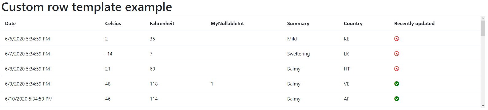

 # Sve-Blazor-DataTable

Blazor DataTable component with support for client/server side paging, filtering and sorting, build on top of bootstrap 4.


 

## Important Notice
This project is still under active development! Currently an alpha version is available on NuGet, but keep in mind that a later version might contain breaking changes. Make sure to always check the [Changelog](CHANGELOG.md) for more information.


### Installation
1. Install the [NuGet](https://www.nuget.org/packages/Sve.Blazor.DataTable/) package:

   ```
   > dotnet add package Sve.Blazor.DataTable
   
   OR
   
   PM> Install-Package Sve.Blazor.DataTable
   ```
   Use the `--version` option to specify a specific version to install.

   Or use the build in NuGet package manager of your favorite IDEA. Simply search for `Sve.Blazor.DataTable`, select a version and hit install.

2. Import the components:

   Add the following using statement `@using Sve.Blazor.DataTable` to one of the following: 
   - For global import add it to your  `_Imports.razor` file
   - For a scoped import add  it to your desired Blazor component

3. Reference js interop file:
    
    Add `<script src="/_content/Sve.Blazor.DataTable/js/Virtualize.js"></script>` to your _Host.cshtml or your index.html

## Usage

### DataTable properties
|                  Name                 |                 Type                |       Default      |                                                                                             Description                                                                                             |
|:-------------------------------------:|:-----------------------------------:|:------------------:|:---------------------------------------------------------------------------------------------------------------------------------------------------------------------------------------------------:|
| Items                                 | IList                               | List               | The list of items to display                                                                                                                                                                        |
| UsePaging                             | bool                                | false              | Boolean indicating whether to use paging or not                                                                                                                                                     |
| PageNr                                | int                                 | 1                  | The number of the current page (only applicable when property UsePaging is true)                                                                                                                    |
| PageSize                              | int                                 | 10                 | The amount of items shown on a page (only applicable when property UsePaging is true)                                                                                                               |
| PageCount                             | int                                 | 1                  | The total amount of pages (only applicable when property UsePaging is true)                                                                                                                         |
| FetchData                             | Func<RequestArgs, Task>?            | null               | The method used for fetching and manipulating data (paging, filtering, sorting) on the server. When this method is null, all these actions will be performed on the initial dataset on the client. |
| ShowHeaderFilters                     | bool                                | true               | Indicates whether or not to show the header/grid filters                                                                                                                                            |
| AllowRowSelection        | bool                                             | false               | Indicates whether or not it's possible to select rows                                                                                                                                            |
| RowClickedEvent                     | EventCallback<TModel>                 | null               | The callback for when a row is clicked (only applicable when property AllowRowSelection is true)                                                                                                             |
| SelectedItemCssClass                | string                                | bg-info            | The css class used for the selected row (only applicable when property AllowRowSelection is true)                                                                                                                 |
| SelectedItem                        | TModel                                | null               | The selected item (only applicable when property AllowRowSelection is true)           
                                      |
| Id                                    | string                              | ""                 | The html identifier of the table tag                                                                                                                                                                |
| ContainerCssClass                     | string                              | "table-responsive" | The css class for the container/parent tag of the table                                                                                                                                             |
| CssClass                              | string                              | "table"            | The css class for the table tag                                                                                                                                                                     |
| Styles                                | TableStyle [Enum FLAGS]             | null               | The style flags used for the table                                                                                                                                                                  |
| Attributes                            | ReadOnlyDictionary<string, object>? | null               | Any custom attributes for the table tag (see Blazor docs for more info)                                                                                                                             |
| ContainerHeight                       | int                                 | 300                | The height of the table container in pixels                                                                                                                                                         |
| IncludeSearchButton                   | bool                                | false              | Indicates whether or not to include a search icon. When clicked filters, sorting and paging is performed on the server is FetchData has a value otherwise it happens on the client                  |
| IncludeToggleFilters                  | bool                                | false              | Indicates whether or not to include a toggle icon. When clicked header/grid filters will re or disappear (only applicable when property                                                             |
| SearchOnApplyHeaderFilter             | bool                                | false              | Indicates whether or not a search is instantly triggered when a header/grid filter is applied                                                                                                       |
| AutoAddFilterWhenClickedAndNoneActive | bool                                | true               | Indicates whether or not to add an empty filter rule when a filterable column is clicked an no other filter rules exist.                                                                            |
### DataTableColumn properties
|                  Name                 |                 Type                |       Default      |                                                                                             Description                                                                                             |
|:-------------------------------------:|:-----------------------------------:|:------------------:|:---------------------------------------------------------------------------------------------------------------------------------------------------------------------------------------------------:|
| Items                                 | IList                               | List               | The list of items to display                                                                                                                                                                        |
| UsePaging                             | bool                                | false              | Boolean indicating whether to use paging or not                                                                                                                                                     |
| PageNr                                | int                                 | 1                  | The number of the current page (only applicable when property UsePaging is true)                                                                                                                    |
| PageSize                              | int                                 | 10                 | The amount of items shown on a page (only applicable when property UsePaging is true)                                                                                                               |
| PageCount                             | int                                 | 1                  | The total amount of pages (only applicable when property UsePaging is true)                                                                                                                         |
| FetchData                             | Func<RequestArgs, Task>?            | null               | The method used for fetching and manipulating data (paging, filtering, sorting) on the server. When this method is null, all these actions will be performed on the initial data set on the client. |
| ShowHeaderFilters                     | bool                                | true               | Indicates whether or not to show the header/grid filters                                                                                                                                            |
| Id                                    | string                              | ""                 | The html identifier of the table tag                                                                                                                                                                |
| ContainerCssClass                     | string                              | "table-responsive" | The css class for the container/parent tag of the table                                                                                                                                             |
| CssClass                              | string                              | "table"            | The css class for the table tag                                                                                                                                                                     |
| Styles                                | TableStyle [Enum FLAGS]             | null               | The style flags used for the table                                                                                                                                                                  |
| Attributes                            | ReadOnlyDictionary<string, object>? | null               | Any custom attributes for the table tag (see Blazor docs for more info)                                                                                                                             |
| ContainerHeight                       | int                                 | 300                | The height of the table container in pixels                                                                                                                                                         |
| IncludeSearchButton                   | bool                                | false              | Indicates whether or not to include a search icon. When clicked filters, sorting and paging is performed on the server is FetchData has a value otherwise it happens on the client                  |
| IncludeToggleFilters                  | bool                                | false              | Indicates whether or not to include a toggle icon. When clicked header/grid filters will re or disappear (only applicable when property                                                             |
| SearchOnApplyHeaderFilter             | bool                                | false              | Indicates whether or not a search is instantly triggered when a header/grid filter is applied                                                                                                       |
| AutoAddFilterWhenClickedAndNoneActive | bool                                | true               | Indicates whether or not to add an empty filter rule when a filterable column is clicked an no other filter rules exist.                                                                            |


### Basic table

```cs
<DataTable TModel="WeatherForecast" Items="forecasts">
    <DataTableColumn TModel="WeatherForecast" Property="(e) => e.Date" />
    <DataTableColumn TModel="WeatherForecast" Property="(e) => e.TemperatureC" CustomTitle="Celsius"/>
    <DataTableColumn TModel="WeatherForecast" Property="(e) => e.TemperatureF" CustomTitle="Fahrenheit"/>
    <DataTableColumn TModel="WeatherForecast" Property="(e) => e.MyNullableInt"/>
    <DataTableColumn TModel="WeatherForecast" Property="(e) => e.Summary"/>
    <DataTableColumn TModel="WeatherForecast" Property="(e) => e.Country"/>
    <DataTableColumn TModel="WeatherForecast" Property="(e) => e.UpdatedRecently" CustomTitle="Recently updated"/>
</DataTable>
```


<br />
<br />

### Custom template

```cs
<DataTable TModel="WeatherForecast" Items="forecasts">
    <DataTableColumn TModel="WeatherForecast" Property="(e) => e.Date" />
    <DataTableColumn TModel="WeatherForecast" Property="(e) => e.TemperatureC" CustomTitle="Celsius" />
    <DataTableColumn TModel="WeatherForecast" Property="(e) => e.TemperatureF" CustomTitle="Fahrenheit" />
    <DataTableColumn TModel="WeatherForecast" Property="(e) => e.MyNullableInt" />
    <DataTableColumn TModel="WeatherForecast" Property="(e) => e.Summary" />
    <DataTableColumn TModel="WeatherForecast" Property="(e) => e.Country" />
    <DataTableColumn TModel="WeatherForecast" Property="(e) => e.UpdatedRecently" CustomTitle="Recently updated">
        <Template Context="forecast">
            @if (forecast.UpdatedRecently)
            {
                <i class="fas fa-check-circle" style="color: green;"></i>
            }
            else
            {
                <i class="far fa-times-circle" style="color: red;"></i>
            }
        </Template>
    </DataTableColumn>
</DataTable>
```



<br />
<br />

### Sorting

```cs
<DataTable TModel="WeatherForecast" Items="forecasts">
    <DataTableColumn TModel="WeatherForecast" IsSortable="true" Property="(e) => e.Date"/>
    <DataTableColumn TModel="WeatherForecast" IsSortable="true" Property="(e) => e.TemperatureC" CustomTitle="Celsius"/>
    <DataTableColumn TModel="WeatherForecast" IsSortable="true" Property="(e) => e.TemperatureF" CustomTitle="Fahrenheit"/>
    <DataTableColumn TModel="WeatherForecast" IsSortable="true" Property="(e) => e.MyNullableInt"/>
    <DataTableColumn TModel="WeatherForecast" Property="(e) => e.Summary"/>
    <DataTableColumn TModel="WeatherForecast" IsSortable="true" Property="(e) => e.Country"/>
    <DataTableColumn TModel="WeatherForecast" IsSortable="true" Property="(e) => e.UpdatedRecently" CustomTitle="Recently updated"/>
</DataTable>
```


<br />
<br />

### Pagination

```cs
<DataTable TModel="WeatherForecast" Items="forecasts" UsePaging="true">
    <DataTableColumn TModel="WeatherForecast" Property="(e) => e.Date"/>
    <DataTableColumn TModel="WeatherForecast" Property="(e) => e.TemperatureC" CustomTitle="Celsius"   />
    <DataTableColumn TModel="WeatherForecast" Property="(e) => e.TemperatureF" CustomTitle="Fahrenheit" />
    <DataTableColumn TModel="WeatherForecast" Property="(e) => e.MyNullableInt"/>
    <DataTableColumn TModel="WeatherForecast" Property="(e) => e.Summary"/>
    <DataTableColumn TModel="WeatherForecast" Property="(e) => e.Country"/>
    <DataTableColumn TModel="WeatherForecast" Property="(e) => e.UpdatedRecently" CustomTitle="Recently updated"/>
</DataTable>
```


<br />
<br />

### Filtering

```cs
<DataTable TModel="WeatherForecast" Items="forecasts">
    <DataTableColumn TModel="WeatherForecast" IsFilterable="true" Property="(e) => e.Date"/>
    <DataTableColumn TModel="WeatherForecast" IsFilterable="true" Property="(e) => e.TemperatureC" CustomTitle="Celsius"   />
    <DataTableColumn TModel="WeatherForecast" IsFilterable="true" Property="(e) => e.TemperatureF" CustomTitle="Fahrenheit"/>
    <DataTableColumn TModel="WeatherForecast" IsFilterable="true" Property="(e) => e.MyNullableInt"/>
    <DataTableColumn TModel="WeatherForecast" IsFilterable="true" Property="(e) => e.Summary"/>
    <DataTableColumn TModel="WeatherForecast" IsFilterable="true" Property="(e) => e.Country"/>
    <DataTableColumn TModel="WeatherForecast" IsFilterable="true" Property="(e) => e.UpdatedRecently" CustomTitle="Recently updated"/>
    </DataTable>
```


<br />
<br />

### Header/Grid filters

```cs
<DataTable TModel="WeatherForecast" Items="forecasts" SearchOnApplyHeaderFilter="true">
    <DataTableColumn TModel="WeatherForecast" IsFilterable="true" IncludeHeaderFilter="true" Property="(e) => e.Date"/>
    <DataTableColumn TModel="WeatherForecast" IsFilterable="true" IncludeHeaderFilter="true" Property="(e) => e.TemperatureC" CustomTitle="Celsius"   />
    <DataTableColumn TModel="WeatherForecast" IsFilterable="true" IncludeHeaderFilter="true" Property="(e) => e.TemperatureF" CustomTitle="Fahrenheit"/>
    <DataTableColumn TModel="WeatherForecast" IsFilterable="true" IncludeHeaderFilter="true" Property="(e) => e.MyNullableInt"/>
    <DataTableColumn TModel="WeatherForecast" IsFilterable="true" IncludeHeaderFilter="true" Property="(e) => e.Summary"/>
    <DataTableColumn TModel="WeatherForecast" IsFilterable="true" IncludeHeaderFilter="true" Property="(e) => e.Country"/>
    <DataTableColumn TModel="WeatherForecast" IsFilterable="true" IncludeHeaderFilter="true" Property="(e) => e.UpdatedRecently" CustomTitle="Recently updated"/>
    </DataTable>
```


<br />
<br />

### Out of the box Virtualization

```cs
<DataTable TModel="WeatherForecast" Items="forecasts">
    <DataTableColumn TModel="WeatherForecast">
        <Template Context="forecast">
            @(Array.IndexOf(forecasts, forecast) + 1)
        </Template>
    </DataTableColumn>
    <DataTableColumn TModel="WeatherForecast" IsSortable="true" IsFilterable="true" Property="(e) => e.Date"/>
    <DataTableColumn TModel="WeatherForecast" IsSortable="true" IsFilterable="true" Property="(e) => e.TemperatureC" CustomTitle="Celsius"   />
    <DataTableColumn TModel="WeatherForecast" IsSortable="true" IsFilterable="true" Property="(e) => e.TemperatureF" CustomTitle="Fahrenheit"/>
    <DataTableColumn TModel="WeatherForecast" IsSortable="true" IsFilterable="true" Property="(e) => e.MyNullableInt"/>
    <DataTableColumn TModel="WeatherForecast" IsSortable="true" IsFilterable="true" Property="(e) => e.Summary"/>
    <DataTableColumn TModel="WeatherForecast" IsSortable="true" IsFilterable="true" Property="(e) => e.Country"/>
    <DataTableColumn TModel="WeatherForecast" IsSortable="true" IsFilterable="true" Property="(e) => e.UpdatedRecently" CustomTitle="Recently updated"/>
    </DataTable>
```


<br />
<br />

### Server side support

```cs
<DataTable TModel="WeatherForecast" Items="pagedForecasts.Data" UsePaging="true" FetchData="DoFetchData" PageCount="@pagedForecasts.Paging.PageCount" PageSize="@pagedForecasts.Paging.PageSize">
    <DataTableColumn TModel="WeatherForecast" IsSortable="true" IsFilterable="true" Property="(e) => e.Date"/>
    <DataTableColumn TModel="WeatherForecast" IsSortable="true" IsFilterable="true" Property="(e) => e.TemperatureC" CustomTitle="Celsius"   />
    <DataTableColumn TModel="WeatherForecast" IsSortable="true" IsFilterable="true" Property="(e) => e.TemperatureF" CustomTitle="Fahrenheit"/>
    <DataTableColumn TModel="WeatherForecast" IsSortable="true" IsFilterable="true" Property="(e) => e.MyNullableInt"/>
    <DataTableColumn TModel="WeatherForecast" IsSortable="true" IsFilterable="true" Property="(e) => e.Summary"/>
    <DataTableColumn TModel="WeatherForecast" IsSortable="true" IsFilterable="true" Property="(e) => e.Country"/>
    <DataTableColumn TModel="WeatherForecast" IsSortable="true" IsFilterable="true" Property="(e) => e.UpdatedRecently" CustomTitle="Recently updated"/>
</DataTable>

// Method will be called by the DataTable when necessary
private async Task DoFetchData(RequestArgs<WeatherForecast> args)
{
    pagedForecasts = await ForecastService.SearchForecastAsync(args);
    // Don't forget to call StateHasChanged() since your component is the owner of the DataTable
    StateHasChanged();
}

// ForecastService:
public async Task SearchForecastAsync(RequestArgs<WeatherForecast> args)
{
    IQueryable<WeatherForecast> result = context.Forecasts.AsQueryable();

    // RequestArgs contains all the information about sorting, paging and filtering
    foreach (var filter in args.AppliedFilters)
    {
        // Filters can easily be translated into expressions, 
        // or use the filtering info to create your own filtering solution
        result = result.Where(filter.GenerateExpression());
    }
    
    // Use the Core.Utils to easily apply paging and sorting
    // Or use the paging info in RequestArgs to build your own paging solution
    pagedResult = Sve.Blazor.Core.Utils.ApplyPaging(result, pager);

    return Task.FromResult(pagedResult);
}
```


<br />
<br />

### Support bootstrap table styles

```cs
<DataTable TModel="WeatherForecast" Items="forecasts" Styles="TableStyle.Sm">
....
</DataTable>
```


<br />
<br />


```cs
<DataTable TModel="WeatherForecast" Items="forecasts" Styles="TableStyle.Bordered">
....
</DataTable>
```


<br />
<br />

```cs
<DataTable TModel="WeatherForecast" Items="forecasts" Styles="TableStyle.Borderless">
....
</DataTable>
```


<br />
<br />

```cs
<DataTable TModel="WeatherForecast" Items="forecasts" Styles="TableStyle.Dark">
....
</DataTable>
```


<br />
<br />


```cs
<DataTable TModel="WeatherForecast" Items="forecasts" Styles="TableStyle.Hover">
....
</DataTable>
```


<br />
<br />


```cs
<DataTable TModel="WeatherForecast" Items="forecasts" Styles="TableStyle.Striped">
....
</DataTable>
```


<br />
<br />

### Alignment

```cs
<DataTable TModel="WeatherForecast" Items="forecasts">
    <DataTableColumn TModel="WeatherForecast" TextAlignment="Core.Models.TextAlignment.Center" IsSortable="true" Property="(e) => e.Date"/>
    <DataTableColumn TModel="WeatherForecast" TextAlignment="Core.Models.TextAlignment.End" IsSortable="true" Property="(e) => e.TemperatureC" CustomTitle="Celsius"   />
    <DataTableColumn TModel="WeatherForecast" TextAlignment="Core.Models.TextAlignment.Left" IsSortable="true" Property="(e) => e.TemperatureF" CustomTitle="Fahrenheit"/>
    <DataTableColumn TModel="WeatherForecast" TextAlignment="Core.Models.TextAlignment.Right" IsSortable="true" Property="(e) => e.MyNullableInt"/>
    <DataTableColumn TModel="WeatherForecast" TextAlignment="Core.Models.TextAlignment.Start" IsSortable="true" Property="(e) => e.Summary"/>
</DataTable>
```


<br />
<br />

## License

This project is licensed under the MIT License - see the [LICENSE](LICENSE) file for details
